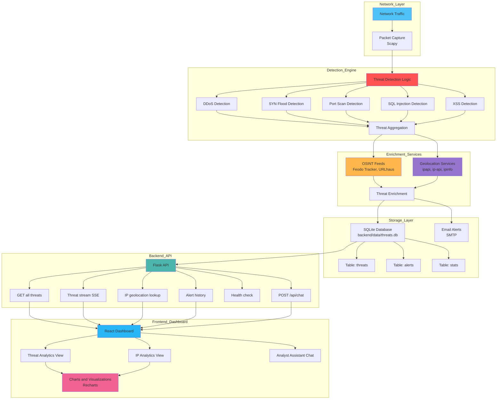
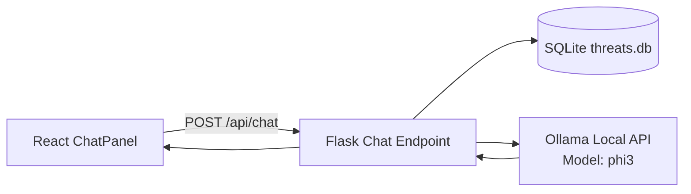

# Network Threat Detection & Analytics

A real-time network threat detection and analytics project that captures live traffic, detects common attack patterns, enriches events using OSINT feeds, and visualizes threats on a modern web dashboard. Built as a learning-focused project to understand detection engineering, packet analysis, and streaming analytics.

## 🎯 Project Status

### ✅ Completed Features
- ✅ **Threat Detection Engine** - DDoS, SYN flood, port scanning, SQL Injection, XSS detection
- ✅ **OSINT Enrichment** - Feodo Tracker (IPs), URLhaus (domains) integration
- ✅ **IP Geolocation Service** - Multi-provider geolocation with automatic fallback
- ✅ **Modern Dashboard UI** - Eye-catching design with gradients, animations, glassmorphism
- ✅ **IP Analytics Page** - Dedicated page for detailed IP threat analysis
- ✅ **Real-time Updates** - Server-Sent Events (SSE) for live threat streaming
- ✅ **Configuration System** - Centralized JSON-based configuration management
- ✅ **Alert History** - Persistent alert tracking and management
- ✅ **Export Functionality** - CSV and JSON export capabilities
- ✅ **Threat Details Modal** - Expanded threat information with geolocation
- ✅ **Advanced Filtering** - Search, filter by type, sorting, pagination
- ✅ **Theme Support** - Dark/Light theme toggle
- ✅ **SQLite Storage** - Threats, alerts, and stats persisted in a single DB
- ✅ **Packet Metadata & Count** - TTL, flags, payload size; packets processed in health

### 🚧 Known Limitations
- No authentication/authorization (planned for future)
- Pattern-based detection may produce false positives
- Static volumetric thresholds

## 🏗️ Architecture

### System Architecture Diagram


## 🤖 LLM Analyst Assistant

- Local-only assistant using Ollama and `phi3`
- Backend endpoint: `POST /api/chat` accepts `{ "message": "..." }`
- Friendly, question-focused reply followed by short analyst bullet points
- Prompt grounded with last 24h stats, top IPs, top ports, hourly trend, SYN/ACK ratio
- Frontend component: `src/components/ChatPanel.jsx`
- No changes to detection logic or existing endpoints
- Requires Ollama running at `http://localhost:11434` with `phi3` pulled

### LLM Chat Flow Diagram


### Setup (Local)
- Install Ollama and pull `phi3`
  - `ollama pull phi3`
  - `ollama run phi3`
- Start backend on `http://localhost:5000`
  - `python backend/api/server.py`
- Start frontend
  - `npm start` inside `frontend/threat-analytics-ui`

### Testing
- Validate chat endpoint:
  - `curl -X POST http://localhost:5000/api/chat -H "Content-Type: application/json" -d "{\"message\":\"Summarize last 24h threats\"}"`
- Validate dashboard chat:
  - Open the dashboard, use the chat panel for:
    - “Summarize last 24h threats”
    - “Why are SYN floods increasing?”
    - “Which IPs look most suspicious?”

## ✨ Features

### Threat Detection
- **DDoS Detection**: Volume-based detection (configurable threshold)
- **SYN Flood Detection**: Ratio-based SYN/ACK analysis
- **Port Scanning**: Multiple unique port access detection
- **SQL Injection**: Pattern matching in HTTP payloads
- **XSS Attacks**: Cross-site scripting pattern detection
- **OSINT Integration**: Automatic threat intelligence lookup

### IP Geolocation ✅
- **Multi-Provider Support**: ipapi.co, ip-api.com, ipinfo.io
- **Automatic Fallback**: Switches providers on failure
- **Caching**: Reduces API calls and improves performance
- **Private IP Handling**: Detects and labels local/private networks
- **Rate Limiting**: Respects API limits

### Dashboard Features ✅
- **Real-time Updates**: Live threat streaming via SSE
- **Statistics Cards**: Total threats, DDoS, port scans, malicious IPs
- **Timeline Charts**: 24-hour threat activity visualization
- **Distribution Charts**: Pie charts for threat type distribution
- **30-Day Trends**: Long-term threat analysis
- **Advanced Filtering**: Search, filter by type, sorting
- **Pagination**: Handle large datasets efficiently
- **Export**: CSV and JSON export functionality

### IP Analytics Page ✅
- **IP Statistics**: Total threats, threat types, ports targeted
- **Geolocation Display**: Country, city, coordinates, ISP
- **Time Range Selection**: 24h, 7d, 30d views
- **Threat Timeline**: Hourly threat activity chart
- **Threat Distribution**: Pie chart by threat type
- **Port Analysis**: Bar chart of targeted ports
- **Recent Threats Table**: Latest threats from the IP

### Configuration System ✅
- **JSON Configuration**: Easy-to-edit config file
- **Environment Variables**: Override config with env vars
- **Detection Thresholds**: Configurable attack thresholds
- **Alert Settings**: Email, throttling, SMTP configuration
- **OSINT Settings**: Feed URLs and update intervals
- **Geolocation Settings**: Provider selection and API keys

## 🛠️ Tech Stack

### Backend
- **Python 3.10+**: Core language
- **Flask**: Web framework and REST API
- **Flask-CORS**: Cross-origin resource sharing
- **Scapy**: Packet capture and analysis
- **Pandas**: Data manipulation and CSV handling
- **NumPy**: Numerical operations
- **Requests**: HTTP client for OSINT/geolocation APIs

### Frontend
- **React 19**: UI framework
- **React Router 6**: Client-side routing ✅
- **Recharts**: Chart library for visualizations
- **Modern CSS**: Gradients, animations, glassmorphism ✅

### Services
- **Geolocation APIs**: ipapi.co, ip-api.com, ipinfo.io ✅
- **OSINT Feeds**: Feodo Tracker, URLhaus
- **Email**: SMTP for alerts

### Storage
- **SQLite**: Persistent storage (`backend/data/threats.db`) with `threats`, `alerts`, `stats`

## 🚀 Setup

### Prerequisites
- Python 3.10+
- Node.js 18–20 (LTS)
- Npcap (Windows) or libpcap (Linux/Mac) for packet capture
- Git

### Backend Setup

1. **Install Python dependencies:**
```bash
cd backend
pip install -r requirements.txt
```

2. **Configure the system:**
   - Edit `backend/config.json` to customize settings
   - Or set environment variables (see Configuration section)

3. **Start the Flask API:**
```bash
cd backend/api
python server.py
```
The API will start on `http://localhost:5000`

4. **Verify API is running:**
```bash
curl http://localhost:5000/api/health
```

### Frontend Setup

1. **Install Node.js dependencies:**
```bash
cd frontend/threat-analytics-ui
npm install
```

2. **Start the development server:**
```bash
npm start
```
The dashboard will open at `http://localhost:3000`

### Detection Engine Setup

1. **Identify your network interface:**
```bash
cd backend/detectors
python admincheck.py
```

2. **Update network interface in config:**
   - Edit `backend/config.json`
   - Set `network_interface` to your interface ID

3. **Run the detector (requires admin privileges):**
```bash
python detector.py
```

**Note**: Packet capture requires elevated privileges. On Windows, run as Administrator.

## ⚙️ Configuration

### Configuration File (`backend/config.json`)

The system uses a JSON configuration file with the following structure:

```json
{
  "network_interface": "\\Device\\NPF_{...}",
  "detection": {
    "ddos_threshold": 300,
    "port_scan_threshold": 10,
    "sql_injection_threshold": 3,
    "xss_threshold": 3,
    "syn_flood_threshold": 200,
    "syn_ack_ratio_threshold": 0.1,
    "time_window_seconds": 10
  },
  "alerts": {
    "enabled": true,
    "throttle_seconds": 300,
    "smtp_server": "smtp.gmail.com",
    "smtp_port": 587
  },
  "osint": {
    "feodo_tracker_url": "https://feodotracker.abuse.ch/downloads/ipblocklist.txt",
    "urlhaus_url": "https://urlhaus.abuse.ch/downloads/text/",
    "update_interval_hours": 24
  },
  "geolocation": {
    "enabled": true,
    "api_provider": "ipapi",
    "api_key": null
  },
  "storage": {
    "log_file": "data/realtime_logs.csv",
    "alert_history_file": "data/alert_history.json"
  }
}
```

### Environment Variables

Environment variables override config file settings:

```bash
# Network Interface
NETWORK_INTERFACE=\Device\NPF_{...}

# Email Alerts
ALERT_SENDER_EMAIL=your_email@gmail.com
ALERT_SENDER_PASSWORD=your_app_password
ALERT_RECIPIENT_EMAILS=security@example.com,secops@example.com
```

## 📡 API Endpoints

### Threat Endpoints

| Endpoint | Method | Description | Status |
|----------|--------|-------------|--------|
| `/api/threats` | GET | Get all threats with geolocation | ✅ |
| `/api/threats/stream` | GET | SSE stream of new threats | ✅ |
| `/api/threats/export` | GET | Export threats (JSON format) | ✅ |

### Geolocation Endpoints

| Endpoint | Method | Description | Status |
|----------|--------|-------------|--------|
| `/api/geolocation/<ip>` | GET | Get geolocation for IP | ✅ |
| `/api/test-geolocation` | GET | Test geolocation service | ✅ |

### Alert Endpoints

| Endpoint | Method | Description | Status |
|----------|--------|-------------|--------|
| `/api/alerts` | GET | Get alert history | ✅ |
| `/api/alerts/stats` | GET | Get alert statistics | ✅ |

### System Endpoints

| Endpoint | Method | Description | Status |
|----------|--------|-------------|--------|
| `/api/health` | GET | Health check and status | ✅ |

### Example API Calls

```bash
# Get all threats
curl http://localhost:5000/api/threats

# Get geolocation for an IP
curl http://localhost:5000/api/geolocation/8.8.8.8

# Test geolocation service
curl http://localhost:5000/api/test-geolocation

# Get alert history
curl http://localhost:5000/api/alerts?limit=50

# Health check
curl http://localhost:5000/api/health
```

## 🧪 Testing

### Generate Test Traffic

**DDoS Simulation:**
```bash
cd backend/detectors
python ddossample.py
```

**Manual Testing:**
```bash
# SQL Injection test
curl "http://example.com/search?q=%27%20OR%201%3D1"

# XSS test
curl "http://example.com/?q=<script>alert(1)</script>"
```

### Test Geolocation

```bash
# Test with public IP
curl http://localhost:5000/api/geolocation/8.8.8.8

# Test with private IP (should return "Local")
curl http://localhost:5000/api/geolocation/192.168.1.1

# Test geolocation service
curl http://localhost:5000/api/test-geolocation
```

## 📊 Dashboard Usage

### Main Dashboard
1. **View Statistics**: Check threat counts in stat cards
2. **Timeline Chart**: See 24-hour threat activity
3. **Distribution Chart**: View threat type breakdown
4. **30-Day Trends**: Analyze long-term patterns
5. **Filter Threats**: Use search and filter dropdowns
6. **Export Data**: Click export buttons for CSV/JSON
7. **View Details**: Click any threat row for detailed modal

### IP Analytics Page
1. **Navigate**: Click any IP address in the threats table
2. **View Statistics**: See IP-specific threat statistics
3. **Select Time Range**: Choose 24h, 7d, or 30d view
4. **Analyze Patterns**: Review charts and trends
5. **Geolocation Info**: View IP location details

## 🔒 Security Considerations

- ⚠️ **No Authentication**: Dashboard is currently open (planned feature)
- ⚠️ **CSV Storage**: Not suitable for production (database recommended)
- ⚠️ **Educational Use**: Not production-hardened
- ✅ **CORS Configured**: Properly configured for development
- ✅ **Input Validation**: API endpoints validate inputs
- ✅ **Error Handling**: Comprehensive error handling implemented

## 🐛 Troubleshooting

### Common Issues

**Backend won't start:**
- Check if port 5000 is available
- Verify Python dependencies are installed
- Check `backend/config.json` exists

**Frontend can't connect:**
- Ensure backend is running on port 5000
- Check browser console for errors
- Verify CORS is enabled

**Geolocation not working:**
- Check `GEOLOCATION_DEBUG.md` for details
- Verify internet connectivity
- Test with `/api/test-geolocation` endpoint
- Check server logs for errors

**No threats showing:**
- Ensure detector is running
- Check `backend/data/threats.db` exists and has data
- Verify network interface is correct

See `START_SERVER.md` and `GEOLOCATION_DEBUG.md` for detailed troubleshooting.

## 📚 Documentation

- **ENHANCEMENTS.md**: Detailed feature documentation
- **NEXT_STEPS.md**: Roadmap and future enhancements
- **START_SERVER.md**: Server setup and troubleshooting
- **GEOLOCATION_DEBUG.md**: Geolocation service guide

## 🗺️ Roadmap

See `NEXT_STEPS.md` for detailed roadmap. Planned features include:

- Database migration (SQLite/PostgreSQL)
- Authentication & authorization
- Real-time map visualization
- Machine learning anomaly detection
- More OSINT feed integrations
- Advanced filtering and search
- Custom alert rules
- Performance optimizations

## 🤝 Contributing

This is a learning project. Feel free to:
- Report issues
- Suggest improvements
- Submit pull requests
- Share feedback

## 📄 License

MIT License - See LICENSE file for details

## ⚠️ Disclaimer

**This project is for educational and research purposes only.**

- Do not deploy to production without proper security hardening
- Do not expose to the public internet without authentication
- Use responsibly and in compliance with local laws
- Packet capture requires appropriate authorization
- Respect API rate limits and terms of service

## 🙏 Acknowledgments

- **OSINT Feeds**: Feodo Tracker, URLhaus
- **Geolocation APIs**: ipapi.co, ip-api.com, ipinfo.io
- **Open Source Libraries**: Flask, React, Scapy, Recharts

---

**Built with ❤️ for learning detection engineering and threat analytics**
