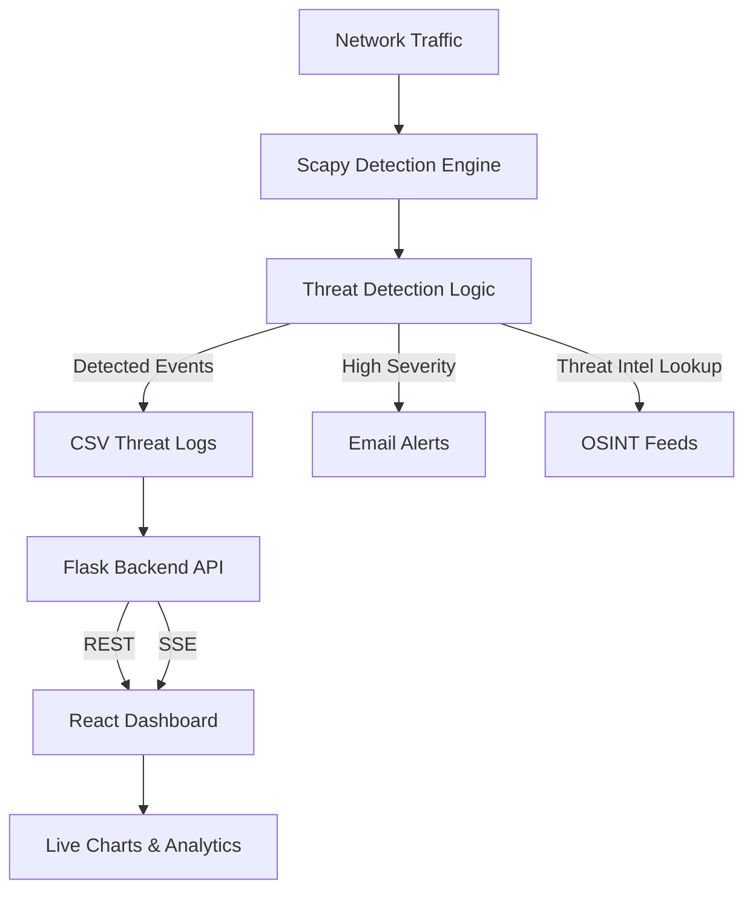

# Network Threat Detection & Analytics

A real-time network threat detection and analytics project that captures live traffic, detects common attack patterns, enriches events using OSINT feeds, and visualizes threats on a web dashboard. Built as a learning-focused project to understand detection engineering, packet analysis, and streaming analytics.

## Features
- Threat detection: DDoS, SYN flood (ratio-based), port scanning, SQL Injection, XSS
- OSINT enrichment: Feodo Tracker (IPs), URLhaus (domains)
- Real-time streaming: Server-Sent Events (SSE)
- Dashboard: counters, time-series trends, distribution charts, filtering, sorting, pagination
- Dark/light theme toggle
- Email alerts with throttling

## Tech Stack
- Detection: Python, Scapy, regex patterns, OSINT feeds
- Backend: Flask, Flask-CORS, pandas, numpy, SSE
- Frontend: React, Recharts
- Storage: CSV log (simple, learning-oriented)

## Architecture


## Project Structure
```
c:\projects\codes
│
├── server.py                 # Flask API (REST + SSE)
├── network2.py               # Packet detection engine (Scapy)
├── ddossample.py             # DDoS traffic generator (demo)
├── test.py                   # Simple sniffer example
├── realtime_logs.csv         # CSV log file (written by detection)
│
└── threat-analytics-ui/      # React dashboard
    ├── src/
    ├── public/
    ├── package.json
    └── README.md
```

## Setup
### Prerequisites
- Python 3.10+
- Node.js 18–20 (LTS)
- Npcap (Windows packet capture)

### Backend
```bash
# Install dependencies
pip install flask flask-cors pandas numpy

# Run the API
python server.py
# API: http://localhost:5000
```

### Detection Engine
```bash
# Optional: additional dependencies for detection
pip install scapy requests

# Run detection (writes to realtime_logs.csv)
python network2.py
```
Notes:
- Packet capture requires appropriate privileges and the correct NPF interface string (`admincheck.py` can help identify interfaces).
- Email alerts read credentials from environment variables.

### Frontend
```bash
cd threat-analytics-ui
npm install
npm start
# Dashboard: http://localhost:3000
```

## Configuration
Environment variables for alerts:
```
ALERT_SENDER_EMAIL=your_email@gmail.com
ALERT_SENDER_PASSWORD=your_app_password
ALERT_RECIPIENT_EMAILS=security@example.com,secops@example.com
```
The dashboard fetches from `http://localhost:5000` by default.

## API Endpoints
- `GET /api/threats` → JSON array of threats (`timestamp`, `threatType`, `sourceIP`, `destinationIP`, `ports`)
- `GET /api/threats/stream` → SSE stream of latest threat events + heartbeat
- `GET /api/health` → Basic status (log file existence and size)

## Testing
### Generate DDoS-like traffic (demo)
```bash
python ddossample.py
```

### Trigger SQL Injection/XSS patterns
Send HTTP requests with typical injection payloads to any site (your outbound request payload is inspected):
```bash
# SQL Injection examples
curl "http://example.com/search?q=%27%20OR%201%3D1"
curl "http://example.com/login?user=admin&pass=%27%20UNION%20SELECT%201,2"

# XSS examples
curl "http://example.com/?q=<script>alert(1)</script>"
curl "http://example.com/?q=%3Cscript%3Ealert(1)%3C%2Fscript%3E"
```
Ensure `network2.py` is running and sniffing the correct interface.

## Limitations
- Pattern-based SQLi/XSS may produce false positives
- Static volumetric thresholds
- CSV storage is not suitable for high-scale or concurrent writes
- No authentication or access control
- Educational, not production-hardened

## License
MIT License

## Disclaimer
This project is for educational and research purposes only. Do not deploy to production or expose to the public internet.
