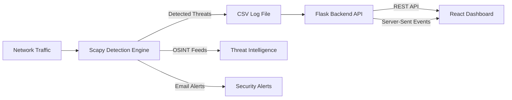

# Real-Time Threat Detection & Analytics Platform

A real-time cybersecurity project that captures live network traffic, detects malicious activity, enriches events using OSINT feeds, and visualizes threats through a live analytics dashboard.

## Features
- DDoS and SYN flood detection
- Port scanning detection
- SQL Injection and XSS detection
- OSINT enrichment (Feodo Tracker, URLhaus)
- Real-time streaming via Server-Sent Events (SSE)
- Email alerting
- Interactive React-based analytics dashboard

## Tech Stack
- Detection Engine: Python, Scapy
- Backend API: Flask, pandas, SSE
- Frontend: React, Recharts
- Data Pipeline: CSV-based ingestion

## Architecture
Scapy Detectors → CSV Logs → Flask API (REST + SSE) → React UI



## Setup Instructions

1.Clone Repository
```bash
git clone https://github.com/<your-username>/<repo-name>.git
cd <repo-name>

2. Backend API
pip install -r requirements.txt
python server.py

3. Detection Engine
python network2.py

4. Frontend
cd threat-analytics-ui
npm install
npm start

Notes

Designed for local and lab environments

Do not expose to the public internet

Email alerts require environment variables to be set

