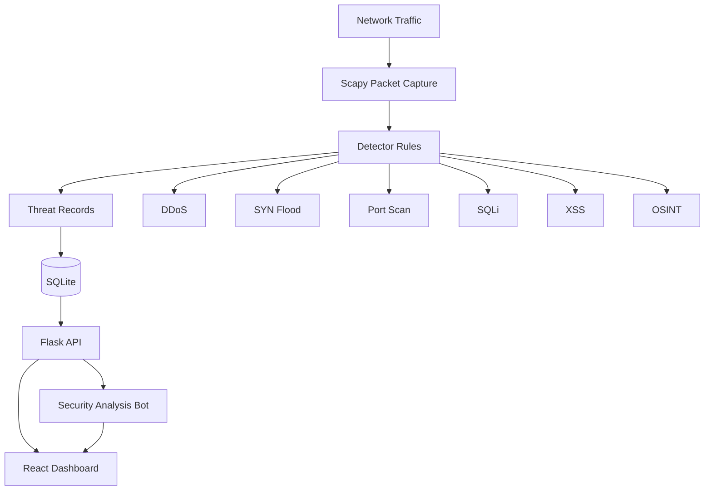

# Network Threat Detection and Analysis Platform

A local-first security analytics project that captures traffic, detects common attack patterns, enriches threats with OSINT and geolocation, and surfaces the results in a live React dashboard.

The current version is built around three ideas:
- real-time packet detection with Scapy
- a Flask API backed by SQLite
- a local security analysis bot that explains what is happening without requiring Ollama or any cloud LLM

## What It Does

### Detection Engine
- DDoS detection with service-focused aggregation
- SYN flood detection using SYN and SYN-ACK behavior
- Port scan detection by unique port fan-out
- SQL injection detection on HTTP request payloads
- XSS detection on HTTP request payloads
- OSINT checks for known malicious IPs and domains

### Backend API
- threat retrieval and live SSE streaming
- alert history and alert statistics
- geolocation lookups
- health endpoint with packet counters and local IPs
- local analysis endpoints for incident summaries and chat-style investigation

### Frontend Dashboard
- live threat table with sorting, filtering, direction labels, and threat details
- activity timeline, distribution charts, and 30-day trend view
- IP analytics drilldown page
- security analysis bot with:
  - 24-hour summary
  - risk score
  - incident clusters
  - anomaly highlights
  - trend watch
  - alert explanation flow

## Architecture


```mermaid
flowchart TB
    A[Network Traffic] --> B[Scapy Packet Capture]
    B --> C[Detector Rules]
    C --> D[Threat Records]
    D --> E[(SQLite)]
    E --> F[Flask API]
    F --> G[React Dashboard]
    F --> H[Security Analysis Bot]
    H --> G

    C --> C1[DDoS]
    C --> C2[SYN Flood]
    C --> C3[Port Scan]
    C --> C4[SQLi]
    C --> C5[XSS]
    C --> C6[OSINT]
```

## Project Layout

```text
backend/
  api/server.py              Flask API + analysis engine
  detectors/detector.py      Live detection logic
  detectors/test_rules.py    Offline detector tests
  data/threats.db            SQLite database
  config.json                Runtime configuration
  db.py                      DB bootstrap and helpers
  geolocation.py             Geolocation service
  alert_history.py           Persistent alert history

frontend/threat-analytics-ui/
  src/ThreatAnalytics.js     Main dashboard
  src/IPAnalytics.js         IP analytics view
  src/components/AnalysisBot.jsx
  src/App.css

scripts/
  run.ps1                    Main project runner
  run.cmd                    Windows wrapper
```

## Quick Start

### Prerequisites
- Python 3.10+
- Node.js 18+
- Npcap on Windows for packet capture
- Administrator privileges for the detector

### One-Time Setup
From the repo root:

```powershell
cd C:\projects\network-threat-detection-platform-
.\scripts\run.cmd setup
```

### Start Everything

```powershell
.\scripts\run.cmd all
```

That opens separate windows for:
- Flask API
- packet detector
- React frontend

### Useful Commands

```powershell
.\scripts\run.cmd api
.\scripts\run.cmd detector
.\scripts\run.cmd detector -DebugHttp
.\scripts\run.cmd frontend
.\scripts\run.cmd test-rules
.\scripts\run.cmd health
```

### Open the App
- Frontend: [http://localhost:3000](http://localhost:3000)
- Health: [http://localhost:5000/api/health](http://localhost:5000/api/health)

## Configuration

Edit [config.json](/C:/projects/network-threat-detection-platform-/backend/config.json).

Key fields:
- `network_interface`
- `detection.ddos_threshold`
- `detection.port_scan_threshold`
- `detection.sql_injection_threshold`
- `detection.xss_threshold`
- `detection.syn_flood_threshold`
- `detection.time_window_seconds`
- `alerts.enabled`
- `osint.update_interval_hours`
- `storage.log_file`

Environment variables supported in the current project include:
- `NETWORK_INTERFACE`
- `ALERT_SENDER_EMAIL`
- `ALERT_SENDER_PASSWORD`
- `ALERT_RECIPIENT_EMAILS`
- `DEBUG_HTTP_PAYLOADS`
- `REACT_APP_API_BASE_URL`

## Analysis Bot

The security analysis bot is local and deterministic. It does not use Ollama.

It works by reading recent threat records from SQLite, computing:
- risk score
- top sources and destinations
- incident clusters
- anomaly summaries
- short-window trend changes
- per-alert explanations

### API Endpoints
- `POST /api/chat`
- `GET /api/analysis/summary`

### Example Questions
- `Give me a 24h security summary`
- `What anomalies stand out?`
- `Show the highest-priority incidents`
- `Explain the latest alert`
- `What should I fix first?`
- `Who are the top source IPs?`

## API Endpoints

### Threats
- `GET /api/threats`
- `GET /api/threats/stream`
- `GET /api/threats/export?format=json`

### Alerts
- `GET /api/alerts`
- `GET /api/alerts/stats`

### Analysis
- `POST /api/chat`
- `GET /api/analysis/summary`

### System
- `GET /api/health`
- `GET /api/geolocation/<ip>`

## Testing

### Offline Detector Tests
Run the repeatable detector harness:

```powershell
.\scripts\run.cmd test-rules
```

It currently validates:
- SQL injection
- XSS
- port scan
- DDoS
- SYN flood

These tests stub alert/database side effects so they validate detection logic without needing email or live traffic.

### Live Testing
For live validation:
1. Start everything with `run.cmd all`
2. Confirm packet counts through `/api/health`
3. Generate traffic from another device where possible
4. Use the dashboard and analysis bot to inspect the resulting threats

## Dashboard Notes

### Threat Table Semantics
- `Actor IP` is the source IP seen in the packet
- `Target IP` is the destination IP seen in the packet
- `Direction` is inferred relative to the monitored host:
  - `inbound`
  - `outbound`
  - `lan`
  - `local`
  - `external`

### Security Analysis Bot Panel
The bot is designed to feel like an analyst workspace rather than a generic chatbot. It includes:
- quick prompt buttons
- snapshot stats
- incident cluster cards
- anomaly cards
- trend watch card
- conversational follow-up

## Troubleshooting

### Detector running but no threats appear
- run the detector as Administrator
- verify `network_interface` in `backend/config.json`
- check `/api/health` and make sure `packetsProcessed` is increasing
- try `run.cmd detector -DebugHttp` to inspect HTTP payload visibility

### Frontend cannot reach backend
- confirm the API is running on port `5000`
- check `REACT_APP_API_BASE_URL`
- run `run.cmd health`

### Detector tests fail on OSINT fetch
- offline environments may block feed refresh
- this does not prevent local rule tests from running

### Frontend build issues
- if a build fails with `EPERM` on `build/asset-manifest.json`, close anything holding the build folder open and retry

## Current Limitations
- no authentication or role-based access
- rule-based detections can still produce false positives
- thresholds are static rather than adaptive
- packet capture visibility depends on the correct network interface and privileges
- detector tests cover the core rules, but not every edge case or OSINT path

## Roadmap
- adaptive baselines and anomaly thresholds
- incident acknowledgement and suppression
- richer per-alert explainability in the modal
- saved investigation views
- auth and multi-user support
- cleaner process stop/restart automation

## License
MIT. See [LICENSE](/C:/projects/network-threat-detection-platform-/LICENSE).

## Disclaimer
This project is for education, research, and local lab use. Do not deploy it to the public internet without proper hardening, authentication, and operational review.
